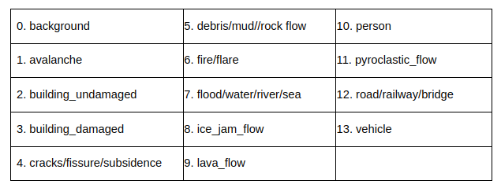

# GradProj_UNet_series
- UAV 온디바이스 재난영역 검출 소프트웨어에 사용된 segmentation AI 모델입니다.
- UNet 계열 모델에 대한 레포지토리입니다.


## U-Net series

### 1) U-Net

- 특징

    ■ 인코더 레이어에서 이미지를 다운샘플링하여 추상화된 feature map을 생성, 디코더에서 인코더에서 생성한 feature map을 이용해 입력이미지와 동일한 크기의 segmentation map을 생성.
- 모델 구조
    

### 2) Attention U-Net

- 특징

    ■ U-Net과 동일한 인코더, 디코더 구조를 가지며 Attention기법을 Skip connection마다 연결하여 모델이 이미지, 입력에서 중요하다고 판단되는 지점에 대해 더 높은 가중치를 두어 segmentation을 원활하게 하기 위해 설계되었음.

- 모델 구조
    

## Dependencies
- 사용한 개발 환경

    `Python 3.6.9` 버전을 권장합니다.
    ```
    Package                       Version
    ----------------------------- -------------------
    imageio                       2.15.0
    matplotlib                    2.1.1
    numpy                         1.19.5
    opencv-python                 4.7.0.72
    pandas                        0.22.0
    pbr                           5.11.1
    Pillow                        8.4.0
    pip                           21.3.12
    scipy                         0.19.1
    torch                         1.10.0a0+git36449ea
    torchvision                   0.11.2
    tqdm                          4.64.1
    virtualenv                    15.1.0
    zipp                          3.6.0
    zope.interface                4.3.2
    ```

## Dataset
- 출처
    
- 1021개의 training set
- 재난 이미지: 512x512x3
- GT 이미지: 512x512x3
    


## 실행
- 스크립트 파일, 파이썬 파일에서 데이터셋 경로를 설정하여야 합니다.

### Training

```bash
# bash
sh training.sh

# python
python training.py
```

###  Output 확인

```bash
sh test.sh
```

- 생성된 solutoin_unet.pyz 파일을 사용하여 inference 를 수행합니다.


### solution, eavluation

    > [evaluation, solution_unet 폴더]
    프로젝트 팀이 참여중인 LPCV 에서 제공하는 evaluation 코드입니다. 모델 평가를 자동화하는데 사용합니다.


- Solution.pyz 생성
- Evalaution 수행
